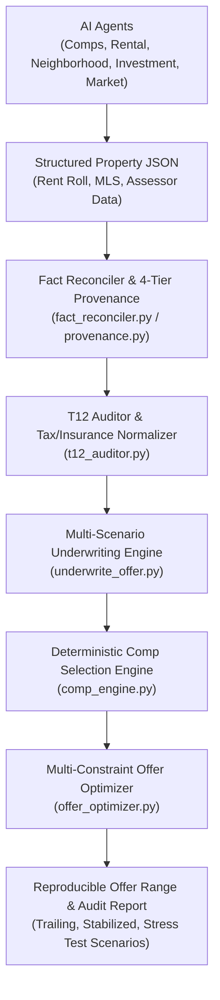

# AI Real Estate Research Engine & Financial Underwriter

An industrial-grade **AI Real Estate Research & Deterministic Financial Underwriter** built for Gemini and Antigravity. It features **5 parallel subagents**, **6 deterministic Python calculation engines**, **multi-scenario underwriting (`underwrite_offer.py`)**, **T12 anomaly auditing**, **4-tier data provenance**, **publication-ready PDF report generation**, and an **automated 20-test evaluation suite**.

---

## 🏛️ Architecture: AI Discovery + Deterministic Underwriting Pipeline



> **Key Rule**: AI Agents discover and summarize property data; **deterministic Python engines** perform all financial calculations, double-counting checks (taxes/insurance), and offer price band optimizations.

---

## 🛠️ Deterministic Calculation & Audit Engines (`scripts/`)

- [`underwrite_offer.py`](scripts/underwrite_offer.py): **Multi-Scenario Underwriting Engine** computing Trailing T12, Stabilized, and Conservative Stress scenarios. Prevents double-counting taxes/insurance and outputs structured audit warnings JSON.
- [`comp_engine.py`](scripts/comp_engine.py): **Comp Eligibility Funnel** (filters property type, distance $\le 1.0\text{ mi}$, recency $\le 180\text{ d}$, unit count $\pm 20\%$), similarity scoring (0–100), outlier removal, valuation dispersion (CV/IQR), and weighted FMV.
- [`offer_optimizer.py`](scripts/offer_optimizer.py): **Three-Value Model** (Comp FMV, Income Value, Investor Max Value), strategy-specific MAOs (Buy-Hold, BRRRR, Flip), **4-Tier Offer Price Bands** (Opening, Recommended, Max Rational, Market Ceiling) & **Hard Walk-Away Price**.
- [`provenance.py`](scripts/provenance.py): **4-Tier Data Provenance** (Tier 1 Assessor/Deed to Tier 4 AI Web Crawl), observation date tracking, and **Offer Confidence Evaluator** (0–100).
- [`t12_auditor.py`](scripts/t12_auditor.py): **T12 Anomaly Auditor** (detects missing tax/insurance, zero vacancy, landlord water/electric, and post-sale tax reassessments).
- [`fact_reconciler.py`](scripts/fact_reconciler.py): **Fact Reconciliation & Conflict Resolution Engine**.
- [`stress_tester.py`](scripts/stress_tester.py): **Mandatory 3-Scenario Stress Testing Engine**.
- [`score_property.py`](scripts/score_property.py): **0–100 Composite Scoring & Grade Engine**.
- [`parse_t12.py`](scripts/parse_t12.py): Financial Statement & T12 Parser.
- [`memory_engine.py`](scripts/memory_engine.py): SQLite Memory & 7-Day Caching Engine.
- [`generate_pdf.py`](scripts/generate_pdf.py): ReportLab PDF Report Generator.

---

## 🧪 Automated Benchmark Evaluation Suite (`evals/`)

The repository includes a 20-test automated evaluation suite verifying all underwriting math, comp eligibility filters, offer price bands, and T12 normalization:

```bash
python3 evals/run_evals.py
```

- `test_comp_engine.py`: Comp funnel filtering, similarity scoring, and outlier exclusion.
- `test_offer_optimizer.py`: Three-value model, strategy MAOs, and walk-away thresholds.
- `test_t12_auditor.py`: Expense normalization, landlord utility inclusion, and tax reassessment.
- `test_stress_tester.py`: Multi-scenario stress test DSCR and cash flow validations.
- `test_fact_reconciler.py`: 4-tier provenance resolution and conflict handling.
- `test_scoring_engine.py`: Property score bounds [0, 100] and letter grade logic.

---

## Quick Start & Commands

### 1. Install Dependencies
```bash
pip3 install -r requirements.txt
```

### 2. Run Multi-Scenario Deterministic Underwriter
```bash
python3 scripts/underwrite_offer.py
```

### 3. Run Master Property Underwriting Pipeline
```bash
python3 scripts/run_underwriting.py
```

### 4. Run EVALS Benchmark Suite
```bash
python3 evals/run_evals.py
```

---

## Subagent & Component Documentation
- 📖 [Comps Agent Guide](agents/comps_agent/README.md)
- 📖 [Rental Agent Guide](agents/rental_agent/README.md)
- 📖 [Neighborhood Agent Guide](agents/neighborhood_agent/README.md)
- 📖 [Investment Agent Guide](agents/invest_agent/README.md)
- 📖 [Market Agent Guide](agents/market_agent/README.md)
- 📖 [EVALS Benchmark Framework Guide](evals/README.md)
